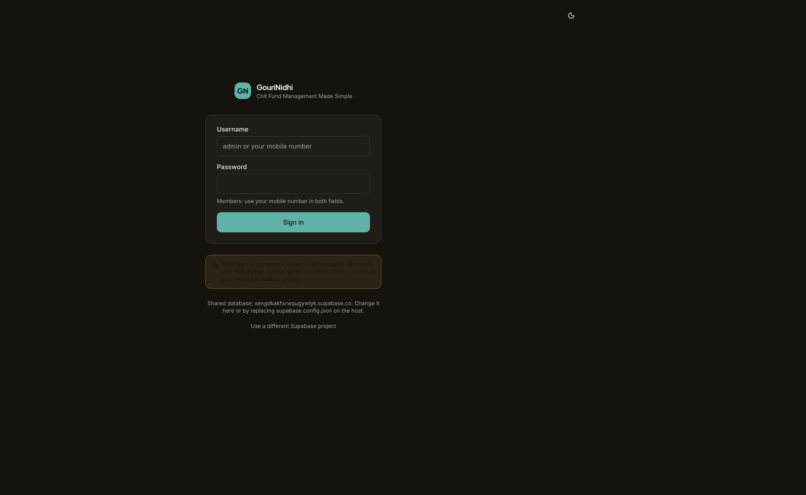
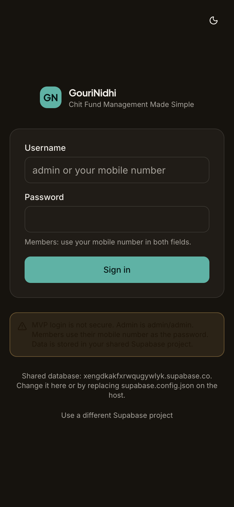
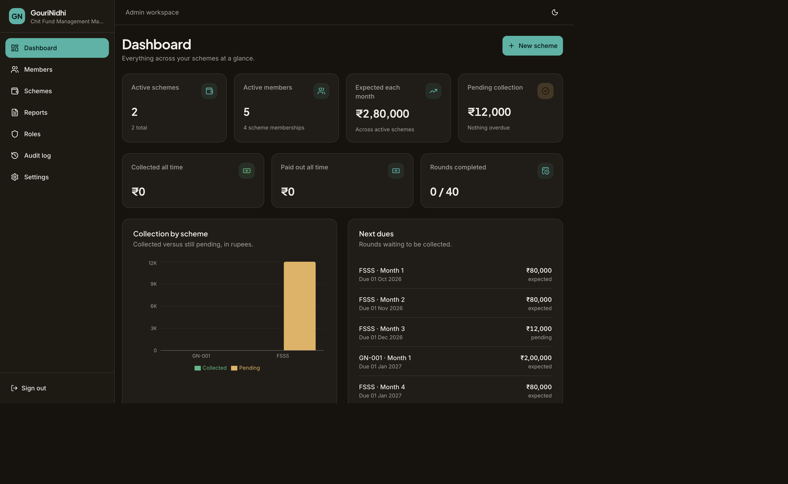
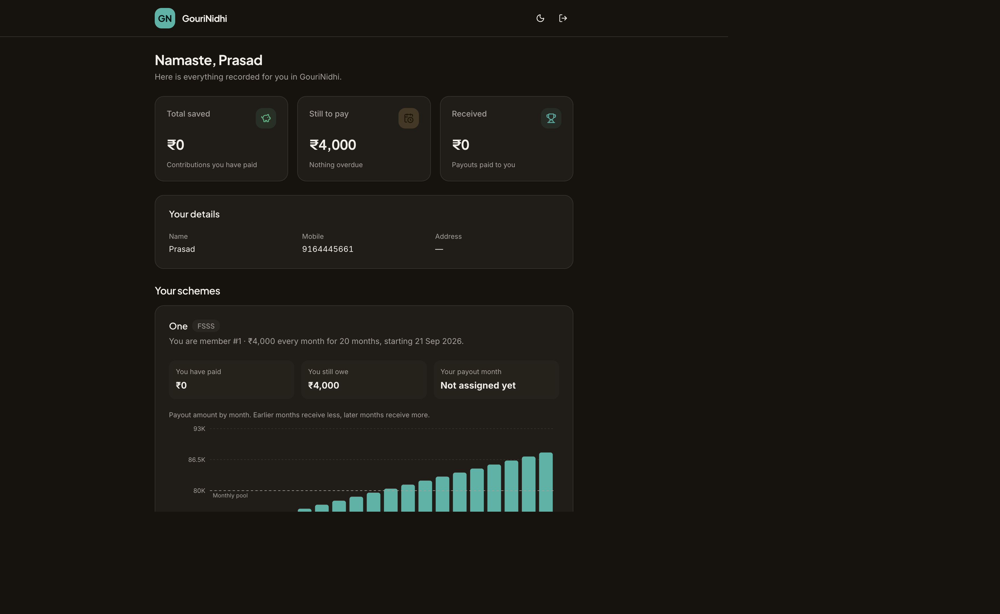
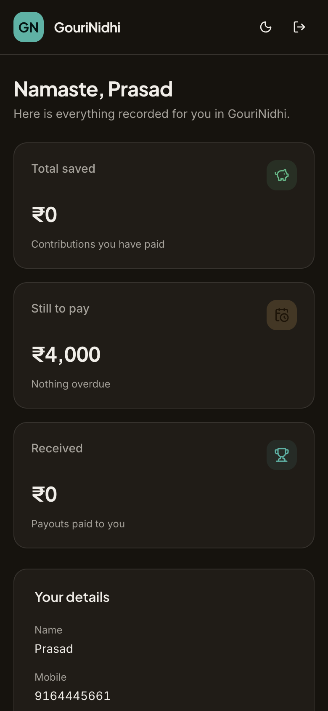

# GouriNidhi

Chit fund management for a family or small group. Admins run schemes on the web. Members sign in on a phone or laptop and only see their own savings, dues, and payout month.

Data lives in a shared [Supabase](https://supabase.com) project so everyone uses the same books. Amounts are stored as whole paise. There is no payment gateway.

---

## Screenshots

Sign-in is the same screen for admin (`admin` / `admin`) and members (mobile number in both fields).

| Web | Mobile |
| --- | --- |
|  |  |

**Admin dashboard** (web)



**Member home** after login

| Web | Mobile |
| --- | --- |
|  |  |

---

## Who sees what

| | Admin | Member |
| --- | --- | --- |
| Sign in | `admin` / `admin` | 10-digit mobile in both fields |
| Home | All schemes, collections, reports | Own dues, savings, payout curve |
| Members directory | Yes | No |
| Other people’s names or amounts | Yes | No |

This login is an MVP. It is not a secure production auth setup.

---

## What it does

- Create rotating chit schemes with a live payout schedule (early months receive less, last month receives more)
- Auto-assign scheme codes (`GN-001`, `GN-002`, …)
- Upload members and schemes from Excel or CSV templates, with row-level validation
- Record monthly collections and payouts
- Deactivate a scheme instead of deleting it — history stays
- Switch Supabase projects from Settings or `supabase.config.json` without a code change

---

## Run locally

You need Node 20+ and a Supabase project.

```bash
npm install
cp .env.example .env.local
```

In `.env.local`, set `VITE_SUPABASE_URL` and `VITE_SUPABASE_ANON_KEY` (publishable/anon key only — never the service role or database password).

On the Supabase project:

1. Authentication → Providers → Email: turn **off** Confirm email
2. Run **Settings → Download setup SQL** in the SQL editor (or apply the repo migrations)

Then:

```bash
npm run dev
```

Open the URL Vite prints (usually `http://localhost:5173`).

| Script | Purpose |
| --- | --- |
| `npm run dev` | Local app |
| `npm test` | Unit tests |
| `npm run build` | Production build |
| `npm run deploy` | Build and deploy to Vercel |

---

## Deploy

Host the SPA (Vercel is set up). Point every device at the same project with:

- Vercel env vars `VITE_SUPABASE_URL` and `VITE_SUPABASE_ANON_KEY`, or
- a `supabase.config.json` file on the host, or
- **Settings → Switch project** in the running app

Stack: React 19, Vite, TypeScript, Tailwind, Supabase (Postgres, Auth, RLS).
